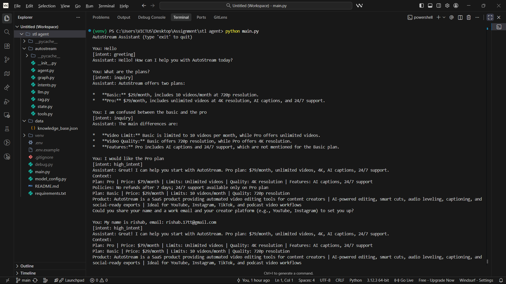

# AutoStream Social-to-Lead Agentic Workflow

**ServiceHive – Machine Learning Intern Assignment**

## Overview

This repository contains a **LangGraph-based conversational AI agent** built for **AutoStream**, a fictional SaaS product offering automated video editing tools for content creators.

The goal of this project is to demonstrate a **real-world GenAI agent**, not a simple chatbot. The agent is capable of understanding user intent, answering product questions using **RAG (Retrieval-Augmented Generation)**, identifying **high-intent leads**, and safely triggering a backend **lead capture tool** only when all required information is collected.

This implementation closely follows ServiceHive’s assignment requirements and evaluation criteria, with a focus on **agent reasoning, clean state management, proper tool gating, and deployability**.

---

## Key Capabilities

### 1. Intent Identification

The agent classifies each user message into one of:

* `greeting`
* `inquiry` (pricing, features, policies)
* `high_intent` (ready to sign up or try a plan)
* `other`

Once a user expresses **high intent**, the agent maintains intent stickiness until the lead is captured, preventing flow breaks across turns.

---

### 2. RAG-Powered Knowledge Retrieval

* Uses a **local JSON knowledge base**
* Builds a **FAISS vector store** over pricing, features, policies, and product info
* Retrieves **top-k relevant snippets** per query
* Enforces a **system guardrail**: the agent answers **only from retrieved context** to reduce hallucinations

---

### 3. Gated Tool Execution (Lead Capture)

When high intent is detected, the agent:

1. Collects **Name**
2. Collects **Email**
3. Collects **Creator Platform** (YouTube, Instagram, etc.)

Only after **all three fields are present** does it call the required mock tool:

```python
def mock_lead_capture(name, email, platform):
    print(f"Lead captured successfully: {name}, {email}, {platform}")
```

The tool **cannot be triggered prematurely** and is protected by explicit state flags.

---

### 4. Stateful Multi-Turn Memory

The agent uses **LangGraph state** to retain:

* Conversation history
* Detected intent
* Retrieved RAG context
* Lead information
* Lead capture completion status

This allows clean handling of 5–6+ turn conversations without losing context.

---

## Tech Stack

* **Language:** Python 3.12.7
* **Orchestration:** LangGraph (LangChain ecosystem)
* **LLM:** Google Gemini (configurable via environment variables)
* **Embeddings:** Gemini embeddings or local Sentence-Transformers fallback
* **Vector Store:** FAISS
* **State Management:** LangGraph Typed State

---

## Project Structure

```
windsurf/
│
├── autostream/
│   ├── agent.py        # Core agent logic & nodes
│   ├── graph.py        # LangGraph workflow definition
│   ├── intents.py     # Intent classification & plan detection
│   ├── rag.py         # FAISS-based RAG pipeline
│   ├── state.py       # Agent state schema & constants
│   ├── tools.py       # Lead extraction & mock CRM tool
│   └── llm.py         # Shared LLM instance
│
├── data/
│   └── knowledge_base.json  # Pricing, policies, product info
│
├── model_config.py    # Centralized model & embedding configuration
├── main.py            # CLI demo runner
├── requirements.txt
├── .env               # Environment variables (not committed)
└── README.md
```

---

## Setup & Run Locally

### 1. Install Dependencies

```bash
pip install -r requirements.txt
```

### 2. Configure Environment Variables

Create a `.env` file in the project root:

```env
GOOGLE_API_KEY=your_api_key_here
MODEL_NAME=models/gemini-2.5-flash-lite   # optional
MODEL_TEMPERATURE=0.2                     # optional
EMBED_MODEL_NAME=all-MiniLM-L6-v2          # optional (local fallback)
```

### 3. Run the CLI Demo

```bash
python main.py
```

---

## Expected Conversation Flow

1. **Greeting**

   ```
   User: Hi, tell me about your pricing.
   ```

2. **RAG-Based Answer**

   ```
   Assistant: Our Pro plan is $79/month with unlimited videos, 4K resolution, AI captions, and 24/7 support...
   ```

3. **Intent Shift**

   ```
   User: I want the Pro plan for my YouTube channel.
   ```

4. **Lead Qualification**

   ```
   Assistant: Great! Could you share your name, email, and creator platform?
   ```

5. **Tool Execution**

   ```
   Lead captured successfully: John, john@email.com, YouTube
   ```

---

## Architecture Explanation (≈200 words)

This agent is implemented using **LangGraph** to model the conversation as a deterministic state machine, which is well-suited for SaaS support and lead qualification workflows. The graph begins with an intent classification node, followed by a retrieval step that queries a FAISS vector store built over a local knowledge base. A conditional router directs high-intent conversations to a dedicated lead-capture handler, while all other intents are served by a response node grounded strictly in retrieved context.

State is explicitly defined using a TypedDict, allowing the agent to persist conversation history, intent, retrieved documents, lead details, and capture status across multiple turns. This prevents common failures such as re-asking for already provided information or prematurely invoking backend tools. Tool execution is gated by both intent and state completeness, ensuring the mock lead capture function is called exactly once per qualified lead.

Model configuration is centralized in `model_config.py`, enabling easy swapping of Gemini models or embedding backends via environment variables. This design prioritizes clarity, safety, and deployability while meeting the assignment’s evaluation criteria around reasoning, RAG correctness, and controlled tool usage.

---

## WhatsApp Deployment Strategy (Webhooks)

To deploy this agent on WhatsApp using the **Meta Cloud API**:

1. Host the agent behind a FastAPI/Flask server with a `/webhook` endpoint.
2. Verify the webhook with Meta (challenge–response).
3. On each incoming WhatsApp message:

   * Map the sender’s phone number (`wa_id`) to a persisted LangGraph state (Redis/DB).
   * Invoke the graph with the user message.
4. Send the assistant’s reply back via Meta’s `/messages` API.
5. Forward captured leads to a CRM instead of printing in production.
6. Add signature verification, rate limiting, and logging for production readiness.

---

## Demo Video

📹 **(2–3 minute screen recording)**
The demo shows:

1. Pricing question answered via RAG
2. High-intent detection
3. Multi-turn lead detail collection
4. Successful `mock_lead_capture` execution

<a href="https://youtu.be/zlx0k5VGVcs" target="_blank">
  
</a>

[](https://youtu.be/zlx0k5VGVcs)


---

### ✅ Final Note

This project was built to reflect **real-world GenAI agent design**, emphasizing correctness, safety, and clarity over shortcuts—aligned with ServiceHive’s expectations for an ML/GenAI intern.

---

> **Note on Model Selection:**
> The assignment specifies *Gemini 1.5 Flash*. At the time of implementation, this exact model identifier was not available via the public API in my environment. I therefore used the closest equivalent Gemini Flash variant accessible via the API. The agent design, reasoning flow, RAG pipeline, and tool-gating logic remain model-agnostic and fully aligned with the assignment requirements.

---